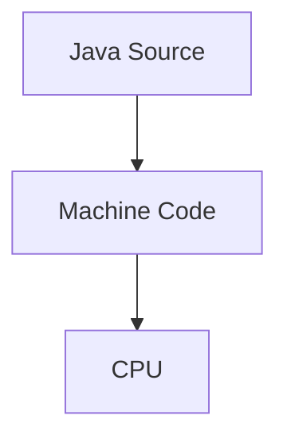
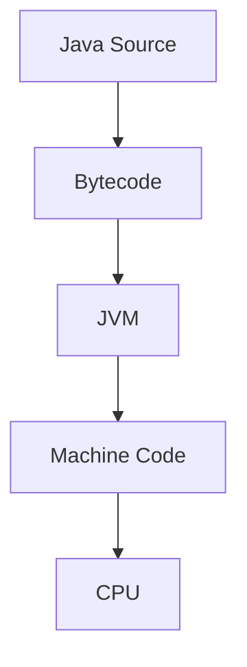
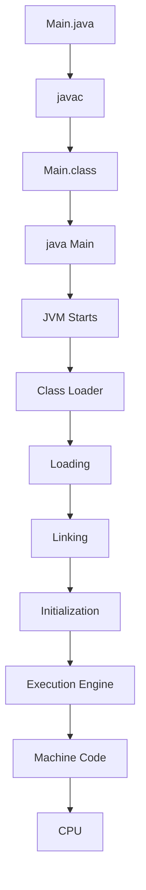
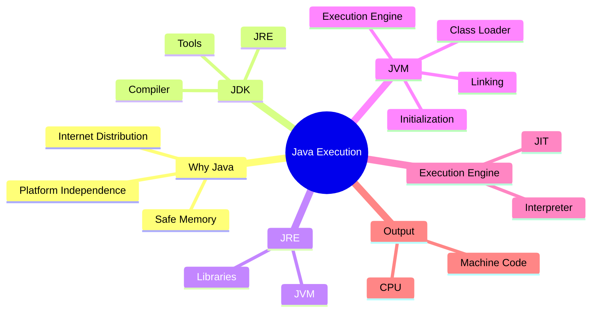

# Java Execution Pipeline (JDK, JRE, JVM)

> **Engineering Journal**
>
> Goal: Understand **why Java was designed this way**, not just memorize JDK, JRE and JVM definitions.

---

# What I know so far

Java was introduced to solve three major engineering problems:

- Platform-dependent executables
- Unsafe manual memory management
- Difficulty distributing software across different machines

Java's solution was **not JVM alone**.

It was an entire execution architecture.

---

# Why does this problem exist?

Imagine writing a program in C++.

```cpp
cout << "Hello World";
```

Compilation produces

```
hello.exe
```

That executable contains **machine instructions**.

Machine instructions are CPU specific.

```
ARM CPU
↓

ARM Instructions

-------------------

Intel CPU

↓

x86 Instructions

-------------------

SPARC CPU

↓

SPARC Instructions
```

An executable compiled for ARM cannot execute on x86.

So every architecture requires a separate compilation.

---

## Engineering Problem

```
Java Source

↓

Compile

↓

Machine Code

↓

Runs only on one CPU Architecture
```

This makes software distribution difficult.

---

# Engineering Mental Model

Java introduced one additional layer.

Instead of



Java uses



The compiler no longer targets hardware.

It targets the JVM.

The JVM handles hardware differences.

---

# Why Bytecode?

Bytecode is **not machine code**.

Bytecode is a universal instruction set understood by every JVM.

```
Java

↓

Bytecode

↓

ARM JVM

↓

ARM Machine Code
```

```
Java

↓

Bytecode

↓

x86 JVM

↓

x86 Machine Code
```

One compilation.

Many platforms.

---

# Java Architecture


---

# JDK

## What is it?

Java Development Kit.

Purpose:

Develop Java applications.

Contains

```
JDK

├── javac

├── JRE

├── Debugging Tools

├── Documentation Tools

└── Development Utilities
```

Think of it as

> Everything required to **write and build Java programs.**

---

# JRE

Java Runtime Environment.

Purpose

Run Java applications.

Contains

```
JRE

├── JVM

├── Java Standard Libraries

└── Runtime Components
```

Think of it as

> Everything required to **run Java programs.**

---

# JVM

Java Virtual Machine.

Purpose

Execute Bytecode.

Responsibilities

- Load Classes
- Verify Bytecode
- Allocate Memory
- Execute Bytecode
- Garbage Collection
- Thread Management
- Runtime Optimization

---

# Complete Execution Pipeline



---

# Class Loader

Purpose

Find `.class` files and load them into JVM memory.

It **does not execute code.**

It only loads classes.

Classes are loaded **on demand**.

---

## Why not load every class?

Suppose Spring Boot contains

```
5000 classes
```

Loading every class at startup would

- Increase startup time
- Consume more memory
- Load many unused classes

Instead

```
Need Class

↓

Load Class

↓

Continue Execution
```

---

# Loading

Simply brings the class into JVM memory.

Developer code is **not executed**.

---

# Linking

Three stages


## Verification

Checks

- Invalid bytecode
- Illegal stack operations
- Invalid references
- Bytecode safety

Purpose

Prevent execution of corrupted or malicious bytecode.

---

## Preparation

Memory is allocated for static fields.

Default values assigned.

Example

```java
static int count;
```

Before initialization

```
count = 0
```

---

## Resolution

Symbolic references become actual references.

---

# Initialization

Only now does Java execute

- Static Variables
- Static Blocks

Example

```java
static {

System.out.println("Static Block");

}
```

This executes **during Initialization**, not Loading.

---

# Execution Engine

CPU cannot execute bytecode.

CPU understands only machine instructions.

Execution Engine converts bytecode into machine code.

---

## Interpreter

Reads bytecode instruction by instruction.

Advantages

- Fast startup

Disadvantages

- Slower for repeated execution

---

## JIT Compiler

JIT = Just In Time Compiler

Idea

```
Method called repeatedly

↓

Hot Method

↓

Compile Once

↓

Native Machine Code

↓

Reuse
```

This avoids repeated interpretation.

---

# Why not JIT compile everything?

Imagine

```
25000 methods
```

Most methods execute only once.

Compiling every method

- Increases startup time
- Wastes CPU
- Wastes memory

Instead

```
Interpreter

↓

Observe

↓

Hot Method

↓

JIT Compile
```

Java optimizes only frequently executed code.

---

# Engineering Interview Questions

## Q1

Why does Java compile into Bytecode instead of Machine Code?

Expected Answer

Because machine code is hardware dependent.

Bytecode allows the same program to execute on multiple architectures through platform-specific JVM implementations.

---

## Q2

Can CPU execute Bytecode?

No.

Only machine instructions.

Execution Engine converts Bytecode into Machine Code.

---

## Q3

Who loads classes?

Class Loader.

---

## Q4

Does Class Loader execute code?

No.

Execution begins only after

```
Loading

↓

Linking

↓

Initialization
```

---

## Q5

When does a static block execute?

During

```
Initialization
```

---

## Q6

Why does JVM verify Bytecode?

To prevent execution of invalid or malicious bytecode.

---

## Q7

Interpreter vs JIT

Interpreter

- Executes immediately
- Better startup

JIT

- Compiles hot methods
- Better long-running performance

---

# Common Mistakes

❌ JVM converts Java Source Code

It converts **Bytecode**.

---

❌ Bytecode is Machine Code

Bytecode is JVM Instructions.

---

❌ Class Loader executes code

It only loads classes.

---

❌ Loading executes static block

Initialization executes static blocks.

---

❌ JIT compiles everything

Only frequently executed code is compiled.

---

# Flash Sale Case Study

Imagine

```
Flash Sale

↓

Millions of Requests

↓

login()

↓

Executed Millions of Times
```

Interpreter becomes inefficient.

JIT detects

```
Hot Method

↓

Compile Once

↓

Native Machine Code

↓

Reuse

↓

Lower CPU Usage
```

This is one reason long-running backend applications become faster over time.

---

# Decision Checklist

Before answering JVM interview questions, verify that your explanation includes:

- Why Java was created
- Why Bytecode exists
- Difference between JDK, JRE and JVM
- Java execution pipeline
- Class Loader responsibilities
- Loading → Linking → Initialization
- Interpreter vs JIT
- Why JIT improves performance
- Why JVM verifies bytecode

---

# Revision Summary


