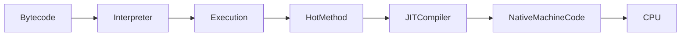

# JIT Compiler (Just-In-Time Compiler)

## What I know so far

The JVM does **not** immediately compile Java Bytecode into machine code.

Instead, every Java program starts execution using the **Interpreter**.

As the application runs, the JVM continuously observes which methods and execution paths are frequently executed.

When a piece of code becomes **Hot**, the JVM's **Just-In-Time (JIT) Compiler** compiles it into native machine code.

Future executions completely bypass interpretation and execute optimized native instructions directly.

This gives Java both

- Fast startup
- High runtime performance

---

# Why does this problem exist?

Suppose the JVM had only one execution strategy.

## Option 1 — Compile Everything

```
Bytecode

↓

Compile Entire Application

↓

Machine Code

↓

Execute
```

Imagine a Spring Boot application containing

```
12,000 methods
```

During one execution,

perhaps only

```
700 methods
```

are actually used.

Compiling the remaining 11,300 methods wastes

- Startup Time
- CPU
- Memory

---

## Option 2 — Interpret Everything

```
Bytecode

↓

Read

↓

Decode

↓

Execute
```

Suppose

```java
for(int i=0;i<1_000_000;i++)
```

The interpreter repeatedly performs

```
Read

↓

Decode

↓

Execute
```

one million times.

Even though the instructions never change.

Again,

a waste of CPU.

---

JVM engineers asked

> Why not combine both approaches?

---

# Engineering Mental Model

Imagine learning a new route to college.

Day 1

```
Google Maps

↓

Turn-by-turn Instructions
```

Slow.

Safe.

After driving the same route every day,

you stop checking Google Maps.

You simply drive from memory.

```
Road

↓

Memory

↓

Fast
```

The JVM behaves exactly the same.

Initially

```
Interpreter
```

Later

```
Native Machine Code
```

---

# Execution Flow



---

# Interpreter

Every method begins here.

```
Bytecode

↓

Read

↓

Decode

↓

Execute
```

Advantages

- Fast Startup
- No Compilation Delay

Disadvantages

Every execution requires decoding Bytecode again.

---

# Hot Code

The JVM continuously monitors execution.

It asks

```
Which methods execute repeatedly?

Which loops execute repeatedly?

Which execution paths dominate runtime?
```

These become

```
Hot Methods

Hot Loops

Hot Paths
```

Notice

The JVM optimizes behaviour,

not source code.

---

# Why "HotSpot"?

The HotSpot JVM is named after this observation.

It searches for

```
Hot Spots
```

inside the application.

Not every method.

Only the frequently executed ones.

---

# JIT Compiler

Once code becomes hot,

JIT compiles Bytecode into native machine code.

```
Bytecode

↓

Machine Code

↓

Cached

↓

Reuse
```

Future executions skip interpretation completely.

---

# Why not compile immediately?

Suppose

```java
void backupDatabase()
```

exists in the application,

but never executes.

Compiling it during startup provides no benefit.

The JVM delays compilation until execution proves the method is important.

Again,

the JVM optimizes the common case.

---

# Inlining

Consider

```java
int add(int a,int b){

    return a+b;

}
```

Inside a loop

```java
for(...){

    total += add(i,j);

}
```

Every iteration normally performs

```
Method Call

↓

Create Stack Frame

↓

Execute

↓

Return

↓

Destroy Stack Frame
```

The overhead becomes larger than the work itself.

JIT optimizes this.

Instead of

```java
total += add(i,j);
```

it effectively becomes

```java
total += i+j;
```

The method body is copied directly into the caller.

No method call.

No additional Stack Frame.

This optimization is called

```
Inlining
```

---

# Escape Analysis

Suppose

```java
public void process(){

    Student student = new Student();

}
```

Question

Does the object ever leave the method?

No.

Nobody returns it.

Nobody stores it.

Nobody shares it.

JIT asks

```
Does this object escape?
```

If the answer is

```
No
```

the JVM may completely avoid Heap allocation.

The object can remain

- in registers
- on the stack
- or even disappear entirely after optimization

This reduces

- Heap Allocation
- Garbage Collection
- Memory Traffic

---

# Dead Code Elimination

Suppose

```java
int x = expensiveCalculation();

return 5;
```

If

```
x
```

is never used,

why execute the calculation?

The JIT removes computations that cannot affect the program's observable behaviour.

This optimization is called

```
Dead Code Elimination
```

---

# JVM Optimization Philosophy

Notice a pattern.

Garbage Collector

```
Most objects die young.

↓

Optimize Young Generation.
```

Class Loader

```
Most classes are never used.

↓

Load lazily.
```

String Pool

```
Many literals repeat.

↓

Share one object.
```

JIT

```
Some code executes repeatedly.

↓

Compile only that code.
```

Every optimization follows the same engineering philosophy.

Observe first.

Optimize later.

---

# Common Interview Misconceptions

### ❌ Java is always interpreted.

✅ Modern Java uses both interpretation and JIT compilation.

---

### ❌ JIT compiles the entire application.

✅ Only hot methods and hot execution paths.

---

### ❌ JIT improves startup performance.

✅ The Interpreter provides fast startup.

JIT improves long-running execution.

---

### ❌ Every object must be allocated on the Heap.

✅ Escape Analysis may eliminate Heap allocation entirely.

---

### ❌ Every line of code executes exactly as written.

✅ JIT aggressively optimizes while preserving observable behaviour.

---

# Decision Checklist

Whenever analysing JVM performance, ask

```
□ Is this method hot?

□ Is repeated interpretation wasting CPU?

□ Can this method be inlined?

□ Does this object escape the method?

□ Is this computation actually required?

□ Would JIT optimise this automatically?
```

---

# Engineering Patterns

The JIT follows one simple engineering philosophy.

```
Observe

↓

Measure

↓

Identify Common Behaviour

↓

Optimize Safely

↓

Never Change Program Behaviour
```

Notice how this philosophy appears throughout the JVM.

```
Garbage Collector

↓

Optimize object lifetime.

----------------------------

String Pool

↓

Optimize immutable Strings.

----------------------------

Class Loader

↓

Optimize startup.

----------------------------

JIT

↓

Optimize execution.
```

The JVM never performs optimization simply because it can.

It performs optimization because **real execution behaviour proves it is worthwhile**.

That is the defining engineering principle behind the Just-In-Time Compiler.
