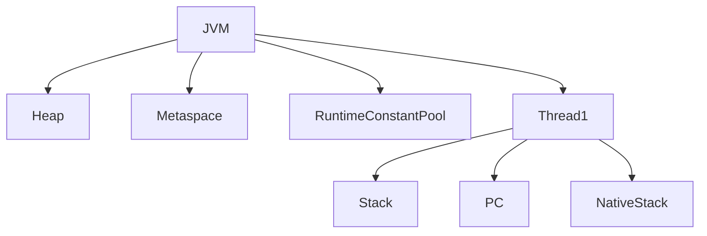

# JVM Runtime Data Areas

## What I know so far

When a Java application starts, the JVM doesn't use one giant block of memory.

Instead, it divides memory into specialized runtime areas, each designed for a specific responsibility.

Some areas are shared by every thread, while others belong exclusively to a single thread.

```
                    JVM Runtime Memory

            Shared                    Thread Private
        ─────────────────        ─────────────────────

        Heap                    Java Stack
        Metaspace               PC Register
        Runtime Constant Pool   Native Method Stack
```

Understanding these areas explains:

- Garbage Collection
- Memory Leaks
- StackOverflowError
- OutOfMemoryError
- Thread Safety
- Spring Singleton Beans
- Performance Debugging

---

# Why does this problem exist?

Imagine a JVM with only one large memory block.

```
Objects

Methods

Local Variables

Class Metadata

Constants

Thread Execution

Everything Mixed Together
```

Problems immediately appear.

- Two threads overwrite each other's local variables.
- Objects disappear when methods return.
- Class metadata gets mixed with runtime objects.
- Garbage Collector cannot efficiently determine object lifetime.

The JVM instead separates memory by **responsibility**, not by data type.

Each runtime area solves a different engineering problem.

---

# Engineering Mental Model

Think of a company.

```
CEO Office
    │
    ▼
Stores Company Rules

(Metaspace)

----------------------------

Warehouse

Stores Products

(Heap)

----------------------------

Employee Desk

Current Work

(Stack)

----------------------------

Sticky Note

Next Task

(PC Register)
```

Everything has its own place.

The JVM follows the same design.

---

# Complete Runtime Memory Layout



Notice

Heap and Metaspace are shared.

Every thread gets its own

- Stack
- PC Register
- Native Method Stack

---

# 1. Java Stack

## Responsibility

Stores method execution state.

Every method call creates a new **Stack Frame**.

```
main()

↓

purchase()

↓

validate()

↓

calculatePrice()
```

The most recently called method always stays on top.

---

## What does a Stack Frame contain?

```
Stack Frame

├── Local Variables
├── Operand Stack
└── Frame Information
```

Local Variables

```
Primitive Variables

Object References

Method Parameters
```

The actual objects are **not** stored here.

Only references.

---

## Example

```java
Student s = new Student();
```

```
Stack

s
 │
 ▼

Heap

Student Object
```

The Stack stores only the reference.

The Student object lives inside the Heap.

---

## Lifetime

Created

↓

Method Starts

Destroyed

↓

Method Returns

Everything inside the frame disappears automatically.

---

## Common Error

```
StackOverflowError
```

Usually caused by deep or infinite recursion.

---

# 2. Heap

## Responsibility

Stores every Java object and array.

```
new Student()

new Order()

new PurchaseRequest()
```

All are allocated in the Heap.

---

## Shared?

Yes.

Every thread shares the same Heap.

This allows

```
Controller

↓

Service

↓

Repository
```

to work with the same object.

---

## Lifetime

Unlike Stack variables,

Heap objects can outlive the method that created them.

```
Method Ends

↓

Reference Still Exists

↓

Object Survives
```

Objects remain alive until they become unreachable.

---

## Why?

Objects often need to survive method execution.

Example

```
Controller creates DTO

↓

Service processes DTO

↓

Repository saves DTO
```

Three methods.

One object.

---

## Common Error

```
OutOfMemoryError
```

---

# Heap Generations

The Heap is divided because

> Most objects die young.

```
Heap

│

├── Young Generation
│     ├── Eden
│     ├── Survivor 0
│     └── Survivor 1
│
└── Old Generation
```

---

### Eden

Every new object starts here.

```
new Object()

↓

Eden
```

---

### Minor GC

Most Eden objects disappear quickly.

Only surviving objects move to Survivor Space.

```
Eden

↓

Minor GC

↓

Survivor
```

---

### Why two Survivor Spaces?

Instead of compacting fragmented memory,

the JVM copies surviving objects between Survivor spaces.

```
S0

↓

Copy

↓

S1

↓

Copy

↓

S0
```

This naturally removes fragmentation.

Eventually objects are promoted to Old Generation.

---

# 3. Metaspace

## Responsibility

Stores class metadata.

Example

```
Student.class

↓

Fields

Methods

Constructors

Annotations

Modifiers
```

Not Student objects.

Only information describing the class.

---

## Shared?

Yes.

Every Student object shares the same metadata.

```
Student Object

↓

Student Metadata
```

One metadata definition.

Millions of objects.

---

## Why?

Otherwise every object would duplicate method definitions.

Huge memory waste.

---

# Runtime Constant Pool

Part of class metadata.

Stores

```
String Literals

Numeric Constants

Method References

Field References
```

It does **not** store objects.

Instead,

it stores symbolic information required during execution.

---

# 4. PC Register

Each thread owns one Program Counter.

Responsibility

```
Which bytecode instruction executes next?
```

Conceptually

```
Instruction 18

↓

Instruction 19

↓

Instruction 20
```

Without a PC Register,

the JVM would lose track of execution whenever threads switch.

---

# 5. Native Method Stack

Java sometimes executes native methods written in C/C++.

Example

```
Thread.sleep()

System.arraycopy()

File I/O
```

These methods execute outside normal Java Stack frames.

Native execution uses a dedicated Native Method Stack.

---

# How Everything Works Together

```java
Student student = new Student();
```

Execution

```
Student.class

↓

Class Loader

↓

Metaspace

↓

Heap allocates Student

↓

Reference stored inside Stack

↓

Method executes

↓

Method returns

↓

Stack Frame removed

↓

Heap object survives if reachable
```

Every runtime area participates.

---

# Flash Sale Engine — July 2026

## Problem

Thousands of purchase requests execute simultaneously.

Each request creates

- PurchaseRequest DTO
- Order Entity
- Validation Objects

## Runtime Behaviour

```
Request

↓

Thread

↓

Stack Frame

↓

Heap Objects

↓

Business Logic

↓

Response

↓

Stack Removed

↓

Heap cleaned later by GC
```

This separation allows thousands of requests to execute independently while sharing common application objects.

---

# Common Interview Misconceptions

### ❌ Stack stores objects.

✅ Stack stores local variables and object references.

---

### ❌ Heap stores everything.

✅ Heap stores only objects and arrays.

---

### ❌ Objects disappear when methods return.

✅ Only references disappear.

Objects survive while reachable.

---

### ❌ String Pool is another Runtime Memory Area.

✅ Modern JVM stores interned Strings inside the Heap.

---

### ❌ Metaspace stores objects.

✅ Metaspace stores class metadata.

---

### ❌ PC Register stores variables.

✅ It stores the address of the next bytecode instruction.

---

# Decision Checklist

Whenever debugging memory problems, ask:

```
□ Is this execution state or object state?

□ Does this data need to be shared?

□ Does it outlive the current method?

□ Is this describing a class or creating an object?

□ Can the Garbage Collector reclaim it?

□ Which runtime area owns it?
```

---

# Engineering Patterns

Notice the recurring JVM philosophy.

```
Separate Responsibilities

↓

Execution
    → Stack

Objects
    → Heap

Metadata
    → Metaspace

Instruction Tracking
    → PC Register

Native Execution
    → Native Stack
```

Instead of one complex memory structure,

the JVM divides memory into specialized areas, allowing each one to be optimized independently.

That same engineering principle appears throughout the JVM:

- Heap → optimized for object lifetime.
- Stack → optimized for method execution.
- Metaspace → optimized for metadata sharing.
- Garbage Collector → optimized for object lifetime.
- JIT → optimized for frequently executed code.

The JVM repeatedly solves complex problems by separating responsibilities and optimizing each area independently.
