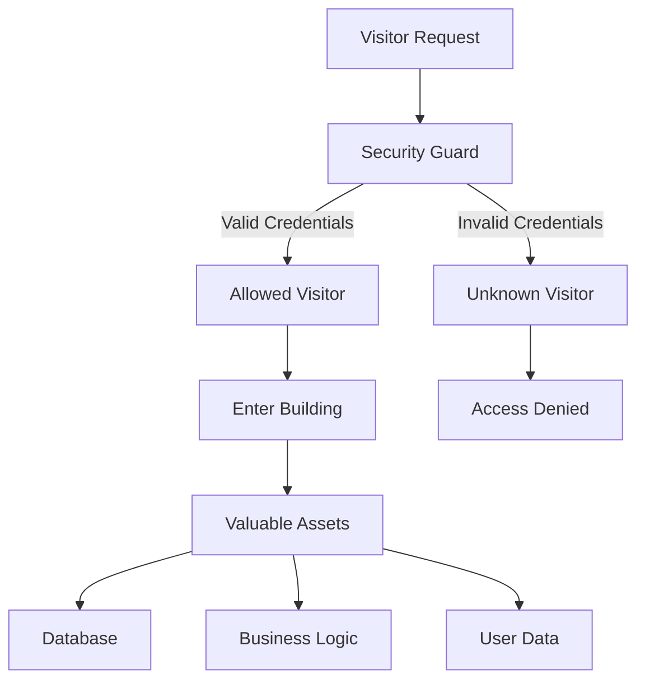
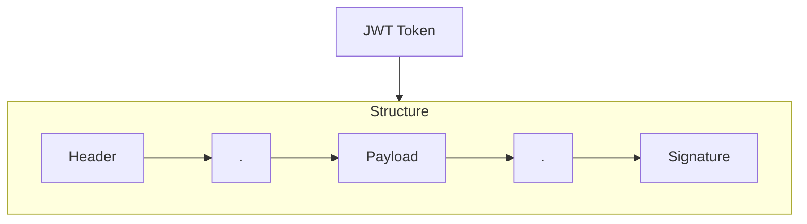

# API Protection

## What I know so far

(Rewrite this section whenever your understanding improves.
This should be readable in under two minutes.)

---

## Why does this problem exist?

What engineering problem are we trying to solve?
-
  - API (Application Programming Interface) are exposed interfaces through which clients and services communicate with a system. Every request entering the application passes through one or more enpoints  
  - Becuase of public APIs are publicly accessible (or accessible within a network), the become primary endpoint for both legitimate users and bad actors to intercat with application.
  - Without protection, anyone could access anything they are not allowed to,  abuse business logic, overload the service, or exploit implementation vulnerabilities.
  - API protection is not just about protecting them from attackers, its about enforcing business rules, enforccing engineering polices like rate limiting or avoid duplicate transaction.
-
What happens if we don't solve it?
 Without proper API protection, a system may experience:

- Unauthorized access to sensitive data or functionality.
- Business logic abuse (for example, duplicate payments or bypassing workflow rules).
- Service degradation or outages caused by excessive or malicious traffic.
- Data corruption due to invalid or manipulated requests.
- Increased security risks and reduced trust in the application.

---

## Engineering Mental Model

An API is like the entrance to a building that contains valuable resources such as business logic, databases, and user data. 
Every incoming request is a visitor. Before allowing the request to enter, the system must verify who the requester is, 
what they are allowed to do, and whether the request follows the application's rules. API protection acts as the security guard 
that performs these checks before any business logic is executed.

## Knowledge Base

| Concept| Used for | Exactly What?| Category| 
  |--|--------|-----------|--------|
 | Authentication | Used to authenticate users| - To determine Who are you? |  Identity|
 |Authorization | Used to control authortiy | -  To determine What you are allowed to do? |   Identity|
  | Sessions | Cookie Based Authentication | Stored on broweser memeory | Way of Authenticating/Storing |
  | JWT | Token Based Authentication | send with request headers |Way of Authenticating/Storing|
  | OAuth(Open Authorization)|  Used to authenticate users| allows one application to access resources from another application on behalf of a user, without the user ever giving away their password | Way of Authorization|
  | CORS (Cross-Origin Resource Sharing)|  security mechanism (browser)| Allows request to flow from one source to other | Mechanism |
  
---
#### Authentication
Way to authenticate users using password/otps/passkeys

#### Authorization
Way to control authority of users so only allowed set of users can access particular APIs, using ROLES
example ADMIN can post some entries in database and users can only read them

#### Sesssions ( Statefull)
Authenticates users using unique sesssion id stored on server memory or database, every request is validated using this sesssion IDs

#### JWT (JSON Web Token) ( Stateless)
Authenticate users using special string token which is encrytpted and have creation and expiration time so one token is valid for specific time

Structure of JWT 

 Header
The header typically consists of two parts: the type of the token, which is JWT, and the signing algorithm being used, such as HMAC SHA256 or RSA.

For example:

{
  "alg": "HS256",
  "typ": "JWT"
}
Then, this JSON is Base64Url encoded to form the first part of the JWT.

Payload
The second part of the token is the payload, which contains the claims. Claims are statements about an entity (typically, the user) and additional data. There are three types of claims: registered, public, and private claims.
Signature
To create the signature part you have to take the encoded header, the encoded payload, a secret, the algorithm specified in the header, and sign that.

##### Sessions vs JWT

Pros
 - Highly Secure
 - Instant Revokation just delete session ids
   
Cons
- Increases database load
- Every request need database lookup
  
Pros
  - No need to call database for every request
  - are uniqually signed, so tamperring makes them invalid
  - as they are signed any service knwing secret can verify it so it horizontally scalable
 
Cons
- are not easy to revoke

##### When to use what?
| Technique | Best For|
|---|--|
| JWT| Microservices, Short lived access|
| Sesssions | Monolith, High control on revokation |

#### OAuth 
A third paty service used to Authenticate users such as Google, Facebook, Github

There are 4 main Roles in Oauth
 - The User (Resource Owner): The person who owns the data (e.g., You, owning your Google Photos).
 - The Client (Third-Party App): The app wanting access to that data (e.g., A photo-printing website).
 - The Authorization Server: The system that verifies the user and issues access permissions (e.g., Google's login server).
 - The Resource Server: The system holding the user's actual data (e.g., Google Photos API)

 #### Cors 
 CORS (Cross-Origin Resource Sharing) is a browser security mechanism, not a server error or a bug. 
 It prevents malicious websites from reading sensitive data from other websites without permission.
 By default, web browsers enforce a strict rule called the Same-Origin Policy (SOP). Under SOP, 
 a website at https://site-a.com cannot read data from https://site-b.com. 
 CORS is the mechanism used to safely relax this rule
 

### Problem

...

### Approach

...

### Worked because

...

### Would NOT reuse when

...

---

## Decision Checklist

- If ...
- If ...
- If ...
